# Day 1：AI 工具与平台入门

> **今日目标：** 不是把原理学到很深，而是 **先建立正确认知，再体验 AI 能为你做什么**。今天结束后，你应该能分清几类主流 AI 工具的适用场景，并尝试把它们用于常见任务。

---

## 模块一：开场与破冰（09:00 - 09:30）

### 1.1 课程介绍

欢迎来到 **人工智能赋能实战课程**。

这不是一门重理论推导的课。三天后，你会带着自己的 AI 原型、工具使用框架和后续行动路径离开。

**课程节奏：**

```
Day 1  →  认识工具，消除陌生感
Day 2  →  学会编程，让 AI 替你干活
Day 3  →  搭建产品，从使用者变成创造者
```

**今天做什么：**
- 认识国内最主流的 AI 平台
- 学会"真正地"使用它们，而不是随便聊两句
- 理解 AI 的核心概念，不再被术语吓到

### 1.2 破冰互动

**快速摸底（举手回答）：**

- 用过 ChatGPT 的请举手？
- 用过豆包/文心一言/Kimi 的请举手？
- 用 AI 写过代码的请举手？
- 用 AI 做过图片/视频的请举手？
- 自己搭过 AI 智能体的请举手？

> **无论你的手举到了哪一题，都没关系。** 今天结束时，所有题你都能举手。

---

## 模块二：AI 现状与大模型原理（09:30 - 10:15）

### 2.1 我们正处在什么时代？

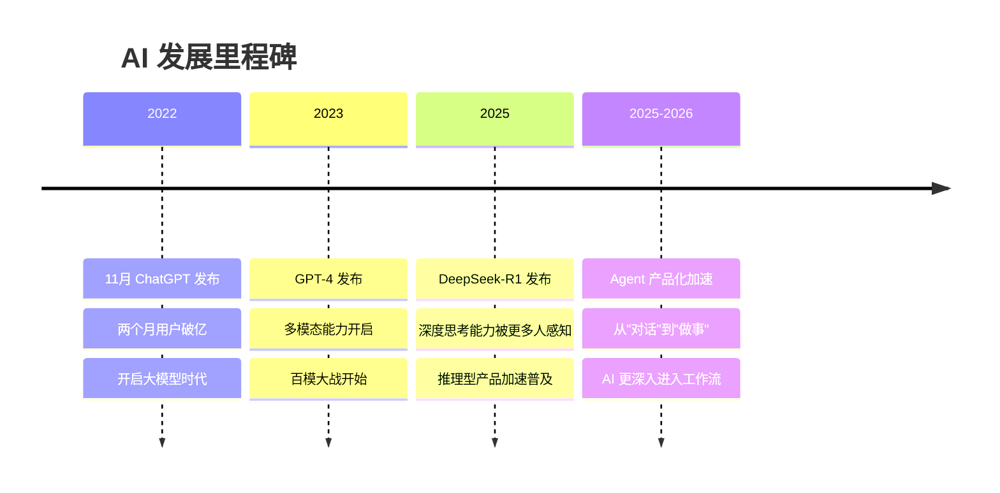

2022年11月，ChatGPT 横空出世，两个月用户破亿。

此后，AI 进入爆发期：

| 时间 | 事件 | 意义 |
|------|------|------|
| 2022.11 | ChatGPT 发布 | 大模型对话的起点 |
| 2023.03 | GPT-4 发布 | 多模态能力开启 |
| 2025.01 | DeepSeek-R1 发布 | 推理型产品被更多普通用户感知 |
| 2023-2026 | 国产模型百花齐放 | 豆包、智谱、Kimi、文心等产品快速演进 |
| 2025-2026 | Agent 产品化加速 | AI 从问答逐步走向工作流执行 |

**关键转变：**

```
2023: AI 大规模进入日常对话
2024-2025: AI 的推理与结构化输出明显增强
2025-2026: AI 更深入进入真实工作流和产品场景
```

### 2.2 大模型到底是什么？

用一个类比理解：

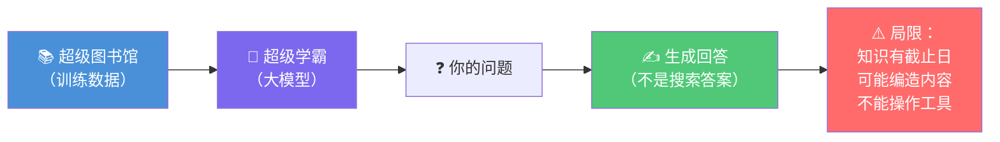

> **大模型 = 一个读过全世界书的超级学霸**
>
> 

- 它读过了互联网上数十亿篇文章、书籍、代码
- 它不是"记住"了这些内容，而是"理解"了语言的模式
- 当你问它问题时，它在"生成"回答，而不是"搜索"答案

**但这个学霸有局限：**

- 它的知识有截止日期（训练数据的时间）
- 它会"一本正经地胡说八道"（幻觉）
- 它不能上网、不能打电话、不能操作电脑（除非你给它工具）

### 2.3 什么是 Token（词元）？


**Token 是大模型处理文字的基本单位。**

简单理解：
- 1 个汉字 ≈ 1-2 个 Token
- 1 个英文单词 ≈ 1-3 个 Token
- 一段 1000 字的中文 ≈ 约 1500-2000 个 Token

**为什么你要关心 Token？**

```
Token 数量决定了：
  ├── 你一次能输入多少内容（上下文窗口）
  ├── 模型回答的长度限制
  └── 你花钱多少（API 按 Token 计费）
```

主流产品的上下文窗口通常从十几万到几十万 Token 不等，具体数值会随模型版本变化。课堂里更重要的是建立两个判断：

| 维度 | 你该关注什么 |
|------|-------------|
| 上下文够不够大 | 能不能一次吃下你的长文档、长对话、长需求 |
| 成本够不够低 | API 调用时是否适合高频使用 |
| 响应够不够稳 | 长输入后回答质量是否明显下降 |

> **实操提示：** 打开豆包，试着粘贴一篇长文章，观察它是否能完整阅读并回答关于文章细节的问题。

### 2.4 什么是上下文（Context）？

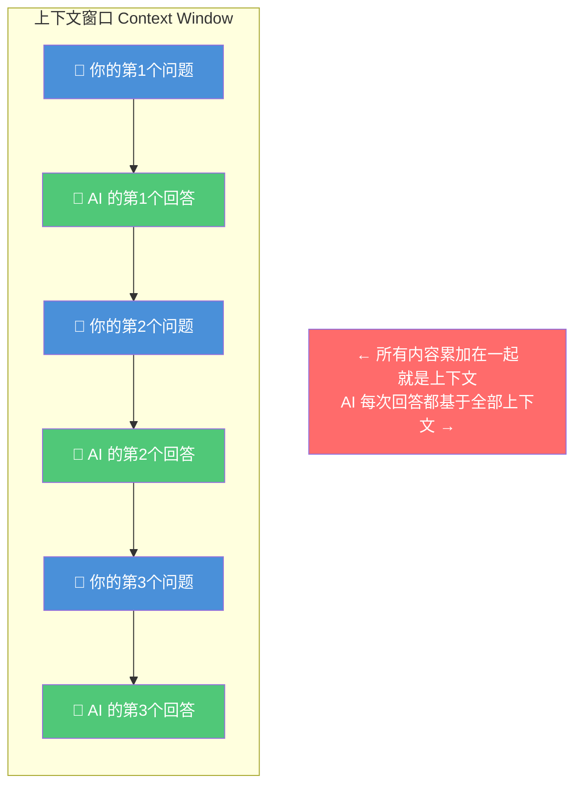

**上下文 = 你和 AI 之间当前对话的所有内容总和**

```
上下文包括：
  ├── 你的问题
  ├── AI 的回答
  ├── 之前所有的对话历史
  └── 系统提示词（如果你设置了的话）
```

**关键理解：**

> **大模型本身不具有人类式的长期记忆。** 单次回答主要依赖当前上下文窗口；至于产品层是否能"记住你"，还取决于平台有没有额外提供记忆功能、历史记录或用户画像机制。

**这就解释了一个重要问题：**

### 2.5 为什么不同任务通常最好分开对话？

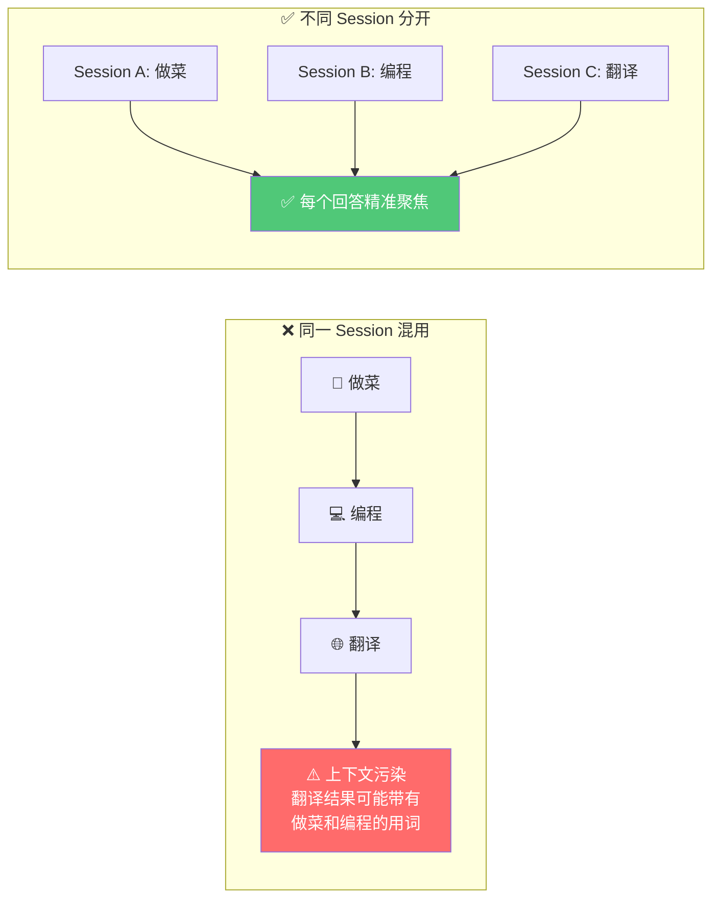

```
❌ 容易出问题的做法：在同一个对话里又聊做菜又聊编程又聊翻译

  对话历史：做菜 → 编程 → 翻译
  AI 的上下文里混入了做菜和编程的内容
  → 翻译结果可能带偏

✅ 更稳妥的做法：把明显无关的任务拆成不同对话

  对话 A：只聊做菜
  对话 B：只聊编程
  对话 C：只聊翻译
  → 每个回答都精准聚焦
```

**原因：**
1. 上下文窗口有限，混用会浪费 Token
2. 前文内容可能干扰后续回答质量，尤其是任务跨度很大时
3. 不同任务的最优提示方式和输出格式往往不同
4. 如果你是围绕同一件事持续推进，放在同一对话里反而可能更有帮助

> **实操：** 在豆包中，观察同一个对话里话题过多时，AI 的回答是否变得"不那么对味"。

### 2.6 什么是幻觉（Hallucination）？

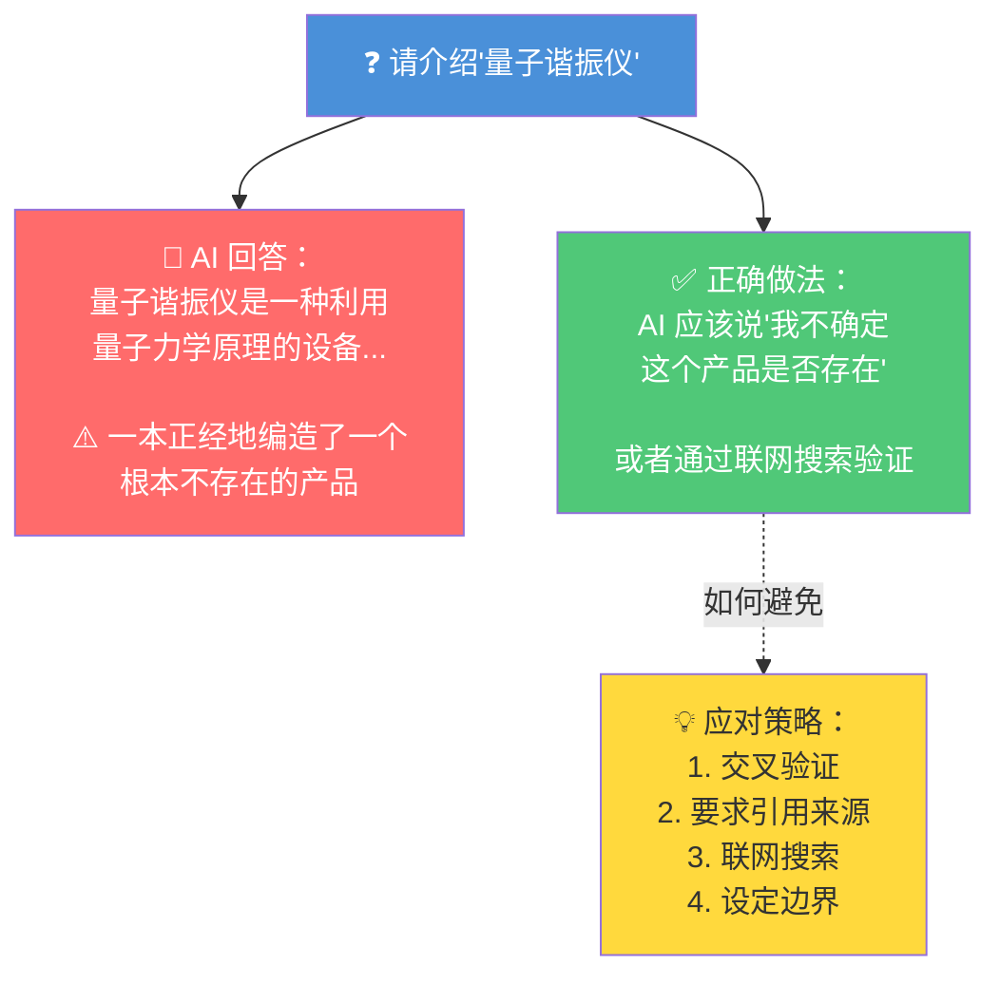

> **幻觉 = AI 自信满满地说出错误的内容**

**为什么会幻觉？**

```
大模型的本质是"预测下一个词"（概率生成）
  → 它不是在"检索事实"，而是在"生成看起来合理的文字"
  → 当它不确定时，会倾向于"编造"而非"承认不知道"
```

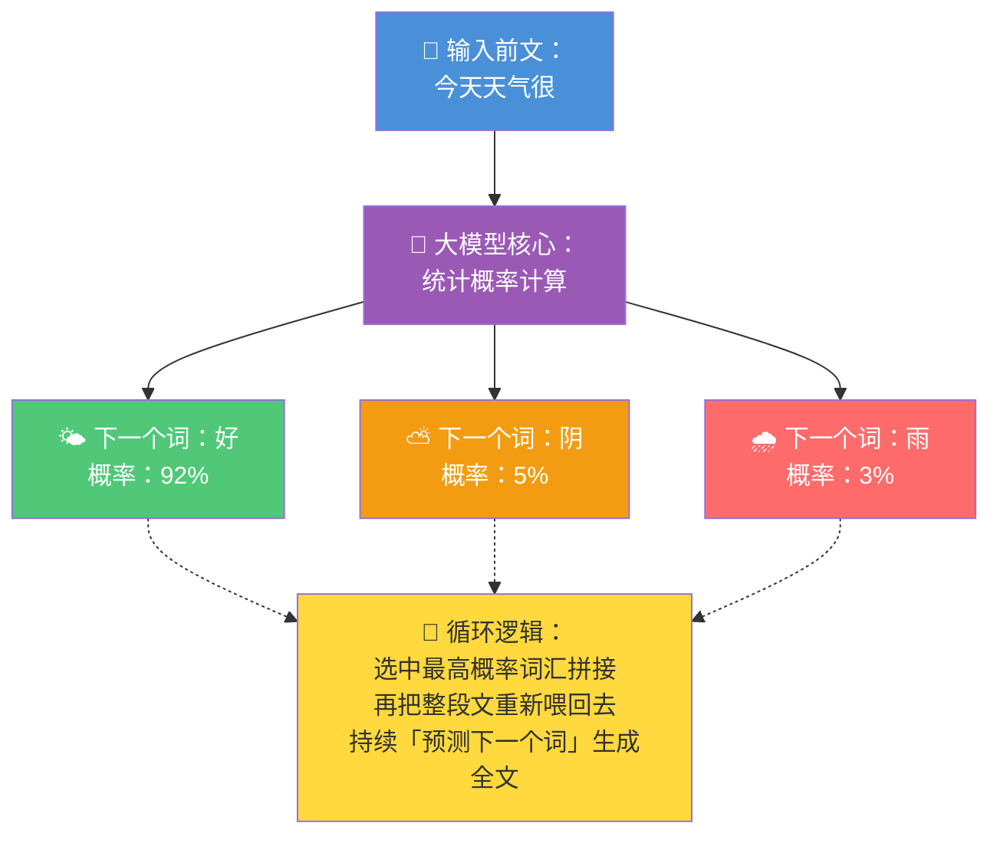


**典型案例：**

```
问：请介绍一下"量子谐振仪"这个产品
AI：量子谐振仪是一种利用量子力学原理...
  （编造了一个不存在的产品描述）
```

**如何应对幻觉？**

1. **交叉验证**：重要信息用多个来源确认
2. **要求引用来源**："请提供出处"
3. **使用联网搜索**：让 AI 搜索实时信息而非依赖训练数据
4. **给 AI 设定边界**："如果不确定，请说'我不确定'"

---

## 模块三：豆包深度使用（10:30 - 11:30）

### 3.1 你用的豆包，可能不是"真正的"豆包


> 大多数人用豆包，就像用百度搜索一样 — 输入问题，拿到答案，结束。
>
> **这只是豆包最基础的能力。** 豆包的真正潜力，远不止"聊天"。

### 3.2 豆包的几种典型使用方式

> **说明：** 不同版本的名称、入口和能力会变化，以下按课堂现场版本演示，重点理解"快速 / 思考 / 专家"三种使用思路。

#### 快速回答（默认对话）
- 快速回答
- 适合简单问题、日常对话
- 但回答深度有限

#### 深度思考（推荐）
- 适合分析、规划、复杂写作
- AI 会先进行更多推理再回答
- 回答更严谨、更有逻辑

#### 专家模式


- 适合专业科研、商业全案、工程级高难度系统性任务
- 搭载顶配旗舰模型，多步深度推理 + 交叉校验闭环执行
- 专业级低幻觉输出，支持超长上下文与多模态深度解析
- 【小白也能拥有的“AI专家”～【建议收藏】】https://www.bilibili.com/video/BV1WxXZBKE4A?vd_source=3216bc8f9baca66e897ed60b45c1ac8b

**三种思路对比：**

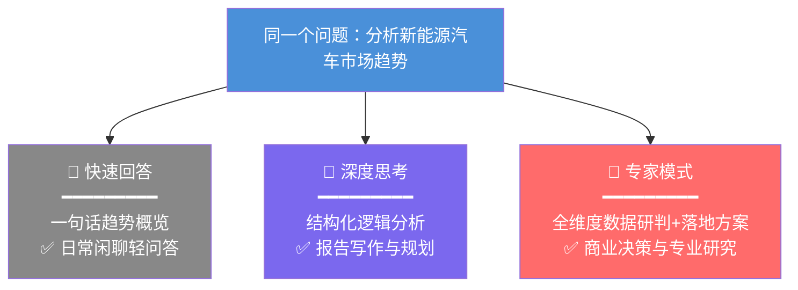

| 特性 | 快速回答 | 深度思考 | 专家模式 |
|------|---------|---------|---------|
| 响应速度 | 快 | 中等 | 慢 |
| 回答深度 | 浅到中等 | 中到深 | 深度 |
| 适用场景 | 日常问答 | 分析、写作、规划 | 专业科研、商业全案、工程级任务 |
| 是否适合新手 | 很适合 | 适合 | 适合 |

> **实操练习：** 在豆包中，分别尝试"直接问"、"打开深度思考"、"使用专家模式"去做同一个任务，对比结果差异。

### 3.3 深度思考模式为什么重要？

#### DeepSeek-R1 的启示


2025年1月，DeepSeek-R1 横空出世，引发了 AI 行业的巨大震动。

**它为什么引发爆点？**

因为它让更多普通用户第一次明显感知到 AI 的"推理过程"：

```
传统模式：  问题 ─────────────→ 回答
                  （黑盒，你不知道它怎么想的）

深度模式：  问题 → [思考过程] → 回答
                  （你可以看到它一步步推理的过程）
```

**这就是"思维链"（Chain of Thought）的力量。**

> **思考 = 一种模型范式**

深度思考已经成为越来越多主流模型和产品提供的能力方向。

**为什么好？类比人类：**

```
做事不能太急：
  1. 先想 → 理解问题（thinking）
  2. 再规划 → 制定方案 （plan）
  3. 再做 → 执行方案 （action）

深度模式就是让 AI 也遵循这个过程
```

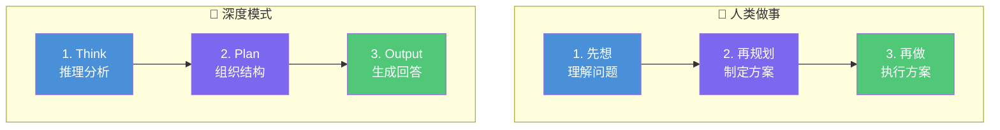

### 3.4 豆包的联网搜索

豆包默认内置搜索函数，会根据问题auto调用Search函数，封装好的搜索功能。

DeepSeek需我们主动点开智能搜索。


**为什么要加联网搜索？**

```
大模型的知识 = 训练数据截止日之前的信息
              ├─ 不同模型都有训练数据截止点
              ├─ 平台产品可能再叠加联网能力
              └─ 不联网时，模型通常不知道"今天发生了什么"

联网搜索 = 让 AI 能获取实时信息
              ├─ 今天新闻
              ├─ 最新股价
              ├─ 实时天气
              └─ 最新论文
```

**实际例子：**
```
❌ 不开联网搜索：
  问："今天北京天气怎么样？"
  答："我无法获取实时天气信息..."

✅ 开联网搜索：
  问："今天北京天气怎么样？"
  答："今天北京晴，最高气温25°C..."（实时数据）
```

> **实操：** 试着问豆包一个需要最新信息的问题，对比开/关联网搜索的效果。

### 3.5 豆包常见能做什么？（以课堂现场版本为准）


很多人以为豆包只是个聊天工具。更准确地说，它通常是一个**围绕对话展开、叠加多种能力的 AI 工作台**：

#### 1. 文字对话
- 日常问答、知识查询
- 深度分析、逻辑推理
- 翻译、改写、总结

#### 2. 生成图片
- 文字描述 → 生成图片
- 风格：写实、插画、水彩、3D 等
- 用途：配图、封面、社交媒体素材


#### 3. 生成视频
- 文字/图片 → 生成短视频
- 适合做营销素材、教学内容

#### 4. 生成音乐
- 描述风格 → 生成背景音乐
- 适合视频配乐、播客片头

#### 5. 生成播客
- 上传文档/链接 → 生成播客式音频
- 两个人对话的形式讲解内容
- 非常适合把长文变音频

#### 6. 生成 HTML 网页
- 描述需求 → 生成完整网页
- 单页应用、落地页、数据展示页
- 可以直接预览和下载

> **实操：** 让豆包帮你做一个简单的个人介绍网页。

```
Prompt 示例：
"请帮我生成一个 HTML 网页，要求：
1. 现代简约风格，深色主题
2. 包含我的头像占位区、名字、简介
3. 包含技能标签（可拖拽的标签样式）
4. 包含一个简单的联系方式表单
5. 响应式设计，手机端也好看"
```

#### 7. 轻应用
- 豆包内置的"小程序"

- 可以通过 Prompt 定义功能

- 无需编程，快速创建工具型应用

  


> **实操：** 创建一个"周报生成器"轻应用。

```
Prompt 示例：
"你是一个周报助手。用户输入本周工作内容要点（可以零散），
你将其整理为格式规范的周报，包含：
- 本周完成事项
- 遇到的问题
- 下周计划
- 需要的支持"
```

#### 8. 扩展插件
豆包的网页版支持多种插件：

插件怎么安装：https://douknowai.feishu.cn/wiki/MKLOwA5J5ilbB5klqiscfDBEnBb?from=from_copylink

| 插件 | 功能 |
|------|------|
| 导出 Word | 将对话内容导出为 .docx 文件 |
| 导出公式 | 支持数学公式渲染和导出 |
| 历史记录 | 管理和搜索历史对话 |
| 文档阅读 | 上传 PDF/Word 文件让 AI 阅读 |
| 更多... | 持续更新中 |


### 3.6 通过 Prompt 做一个简单的 Agent

> **Agent（智能体）= 有工具、有目标的 AI**

用豆包的 Prompt 可以做一个最简单的 Agent：

```
Prompt 示例 — "新闻摘要 Agent"：
"""
你是一个专业的新闻分析助手。每次用户给你一篇新闻链接或新闻内容，
你需要执行以下步骤：
1. 用联网搜索找到相关背景信息
2. 总结新闻要点（不超过5条）
3. 分析这条新闻的影响
4. 给出你的评价（从专业角度）

格式要求：
## 新闻摘要
（要点列表）

## 背景补充
（背景信息）

## 影响分析
（分析内容）

## 专业评价
（评价内容）
"""
```

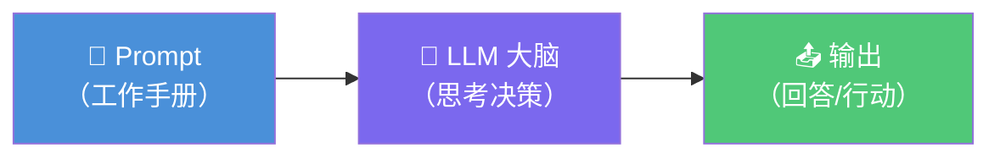

---

## 模块四：核心概念深入（14:00 - 14:45）

### 4.1 大模型的工作原理（简明版）

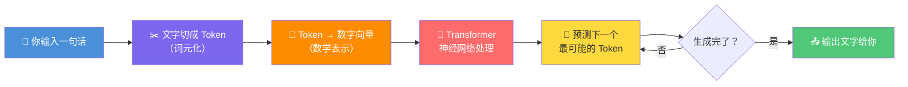

```
你输入一句话
    ↓
文字被切成 Token（词元）
    ↓
Token 被转换为数字向量（数学表示）
    ↓
经过 Transformer 神经网络处理
    ↓
预测最可能的下一个 Token
    ↓
重复上一步，直到生成完整回答
    ↓
输出文字给你
```

**关键理解：**
- 大模型本质上是"预测下一个词"的数学模型
- 它不是"搜索"答案，而是"生成"回答
- 它之所以有用，是因为它从海量数据中学到了语言的模式和知识

### 4.2 多模态 vs 单模态


**单模态模型：** 只能处理一种类型的数据（通常是文字）

**多模态模型：** 能同时处理文字、图片、音频、视频等多种类型的数据

| 模型 | 文字 | 图片 | 音频 | 视频 |
|------|------|------|------|------|
| 典型产品类型 | 文字 | 图片 | 音频 | 视频 |
|-------------|------|------|------|------|
| 文本模型 | ✅ | 视产品而定 | 视产品而定 | 视产品而定 |
| 图文多模态模型 | ✅ | ✅ | 视产品而定 | 视产品而定 |
| 全模态产品形态 | ✅ | ✅ | ✅ | ✅ |

**常见疑问：有些模型明明是"单模态"，为什么也能"看图"？**

> 因为很多平台在"单模态"模型前面加了一个"翻译器"（视觉编码器），把图片先转成文字描述，再交给文字模型处理。这叫"外挂多模态能力"。

```
方式一（原生多模态）：图片直接进入模型处理
方式二（外挂多模态）：图片 → 视觉编码器 → 文字描述 → 文字模型
```

### 4.3 大模型为什么擅长 HTML/XML 代码生成？


你可能注意到，AI 写 HTML/XML 特别好，写其他语言也不差但 HTML 似乎更"顺手"。原因：

```
1. HTML/XML 结构高度规范
   └── 标签成对出现，嵌套规则清晰
   └── 模式相对固定（开标签、内容、闭标签）

2. 训练数据中海量网页
   └── 互联网本身就是最大的 HTML 数据集
   └── 模型见过无数种网页布局和样式

3. 即时可验证
   └── 浏览器直接渲染，对不对一目了然
   └── 反馈循环短，容易迭代改进
```

> **实操：** 让豆包用 HTML 做一个漂亮的个人名片页面，体验它的 HTML 生成能力。

---

## 模块五：Prompt Engineering（14:45 - 15:30）

### 5.1 什么是 Prompt？

> **Prompt = 你给 AI 的指令/提示**

简单来说，就是你跟 AI 说话的方式。

### 5.2 模型能力这么强，还有必要学 Prompt 吗？

**答案是：有必要，但学法变了。**

```
2023 年：需要精心设计 Prompt 才能得到好结果
2024 年：模型变聪明了，简单说就行
2025-2026 年：日常对话直接说，复杂任务仍需结构化 Prompt
```

**什么时候需要精心写 Prompt：**
- 创建可复用的 Agent/智能体
- 需要严格的输出格式
- 专业领域的复杂任务
- 批量处理任务

**什么时候直接说就行：**

- 简单问答
- 日常写作辅助
- 翻译
- 头脑风暴

### 5.3 Prompt 的核心框架

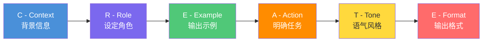

#### CREATE 框架

```
C - Context（背景）：提供必要的背景信息
R - Role（角色）：设定 AI 扮演的角色
E - Example（示例）：给出期望的输出示例
A - Action（任务）：明确要 AI 做什么
T - Tone（语气）：指定输出的语气风格
E - Format（格式）：要求特定的输出格式
```

```
C - Context（背景）：提供必要的背景信息

E - Example（示例）：给出期望的输出示例
A - Action（任务）：明确要 AI 做什么
T - Tone（语气）：指定输出的语气风格
E - Format（格式）：要求特定的输出格式
```


**示例对比：**

```
❌ 普通 Prompt：
"帮我写个周报"

✅ 结构化 Prompt：
"你是一个[专业的项目经理]。
我本周完成了以下工作：
1. 完成了用户登录模块的开发
2. 修复了3个线上Bug
3. 参加了产品需求评审会

请帮我整理成一份[正式、简洁]的周报，
格式包含：本周完成事项、遇到的问题、下周计划。
参考这个格式：
【本周完成】
- xxx
【遇到问题】
- xxx
【下周计划】
- xxx"
```

### 5.4 高阶 Prompt 技巧

#### 少样本学习（Few-shot）
```
"请判断以下评论的情感：

例子1：'这个产品太好了！' → 正面
例子2：'质量太差了，退货' → 负面
例子3：'还行吧，中规中矩' → 中性

现在请判断：
'用了三个月，电池开始不行了，但是整体还行'
→ ?"
```

#### 思维链（Chain of Thought）
```
"请一步步分析以下问题，先推理再给出答案：
如果一家咖啡店每天客流量200人，平均消费35元，
固定成本每天3000元，变动成本占营收40%，
那么月利润是多少？请给出计算过程。"
```

#### 角色扮演
```
"你是一位有20年经验的资深产品经理。
请用产品思维分析以下需求..."
```

---

## 模块六：智谱、Kimi 与即梦（15:45 - 16:30）

### 6.1 国内：智谱清言（ChatGLM）/ 国际：https://chat.z.ai/

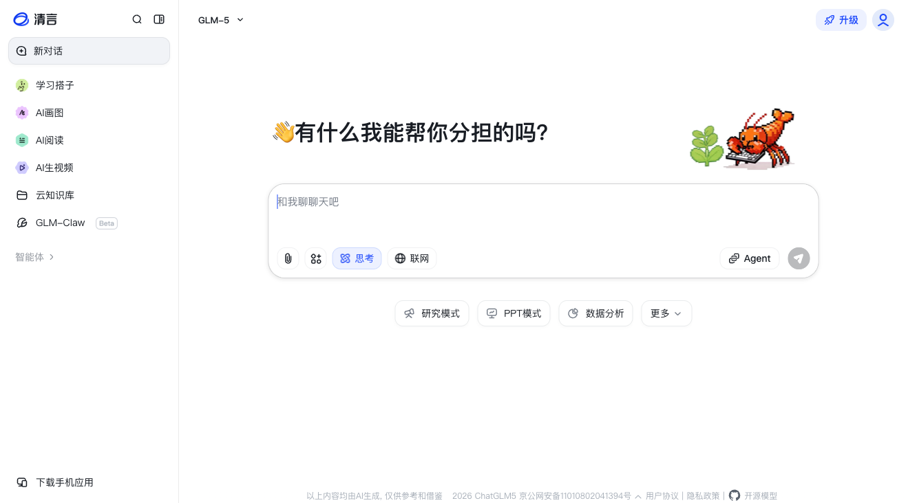

智谱清言的核心特色：**Agent 模式 + PPT 生成**

#### 智谱做 PPT 的原理

```
智谱 PPT 生成的底层流程：

用户描述需求
    ↓
AI 生成 PPT 的文字大纲
    ↓
AI 将大纲转换为 HTML 代码（每页一张幻灯片）
    ↓
利用 HTML 渲染引擎生成视觉效果
    ↓
将 HTML 页面导出为 PPT 格式（.pptx）
    ↓
用户下载编辑
```

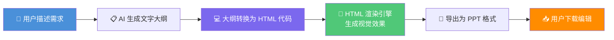

**为什么通过 HTML 生成？**

1. HTML+CSS 的排版能力非常强大
2. 模型生成 HTML 代码的能力很强
3. HTML 可以精确控制布局、颜色、字体
4. 转换为 PPT 格式有成熟的技术方案

> **实操：** 用智谱生成一份"AI 基础入门"主题的 PPT（5-8页），下载后用 PowerPoint 打开编辑。
>
> 
> https://chat.z.ai/space/k1hyv2r0hb10-ppt

### 6.2 Kimi

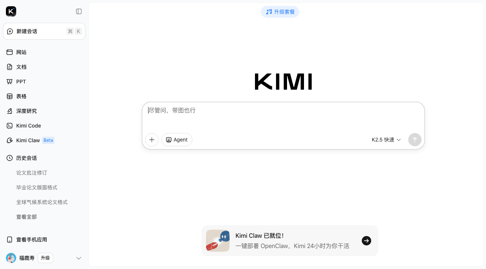

Kimi 的核心特色：

#### 长文本处理
- 支持超长文档阅读（上下文窗口较大，具体数值以官方为准）
- 可以一次读完一本书、一份财报
- 适合文档分析、论文阅读

#### 联网搜索
- 实时搜索互联网信息
- 提供信息来源链接
- 适合需要最新信息的任务

**适用场景：**
```
Kimi 最适合：
  ├── 长文档/长文章阅读与总结
  ├── 学术论文分析
  ├── 竞品调研（需要搜索最新信息）
  └── 资料整理与知识提取
```

> **实操：** 在 Kimi 中上传一份 PDF 文档（或粘贴一篇长文），让它总结要点并回答细节问题。

### 6.3 即梦（Jimeng）


AIGC我的表情包：https://douknowai.feishu.cn/wiki/U2fZwm2DNiKsuJka0N8cPfcenBe?from=from_copylink

即梦是字节跳动旗下的 AI 创作平台，核心能力是 **AI 图片和视频生成**。

#### 即梦能做什么？
- **文字生图**：描述场景 → 生成图片
- **图生图**：上传参考图 + 描述 → 生成新图
- **做海报**：生成活动海报、宣传图
- **做 Logo**：根据品牌描述生成 Logo 方案
- **做视频**：图片/文字 → 短视频

#### AI 生图的原理是什么？

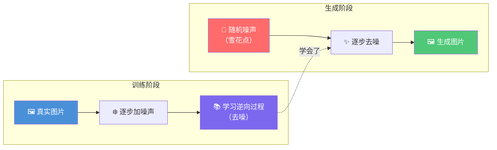

```
AI 生图的核心技术：扩散模型（Diffusion Model）

简单理解：
1. 从一张纯噪声图开始（全是雪花点）
2. AI 学过"什么是猫、什么是风景、什么是人"
3. 它逐步"去噪"——把噪声一点点去掉
4. 每去一步，图片就清晰一点
5. 最终得到你描述的图片

更准确的原理：
训练阶段：
  真实图片 → 逐步加噪声 → 学习逆向过程
生成阶段：
  随机噪声 → 逐步去噪声 → 生成图片

模型学会了"噪声"→"图片"的逆向映射
```

**实际操作 Tips：**

```
好的生图 Prompt 结构：
[主体] + [场景] + [风格] + [细节] + [参数]

示例：
"一只穿着宇航服的橘猫，站在月球表面，
  背景是蓝色地球，皮克斯动画风格，
  高清细节，柔和光线，8K"

技巧：
1. 越具体越好
2. 指定艺术风格（写实、插画、油画、3D等）
3. 加入质量关键词（高清、8K、精细等）
4. 描述光线和氛围
```

> **实操：**
> 1. 用即梦生成一个"AI 培训课程"主题的活动海报
> 2. 为自己的项目/兴趣生成一个 Logo 方案

---

## 模块七：代码绘图与 Agent 初识（16:30 - 17:00）

### 7.1 用 SVG 代码绘图


**什么是 SVG？**

> SVG（Scalable Vector Graphics）= 可缩放矢量图形
> 它是一种用 XML 代码描述图形的格式

**SVG 示例：**

```svg
<svg width="200" height="200" xmlns="http://www.w3.org/2000/svg">
  <circle cx="100" cy="100" r="80" fill="#4A90D9" />
  <text x="100" y="110" text-anchor="middle" fill="white" font-size="24">Hello</text>
</svg>
```

**什么是 XML？**

> XML（eXtensible Markup Language）= 可扩展标记语言
> SVG 属于 XML 家族格式；HTML 是另一种标记语言，语法相似但规则不同（HTML 允许省略闭合标签，XML 不允许）。XHTML 才是 XML 化的 HTML。它们的共同点是都用标签描述结构。

```
HTML：描述网页的结构和内容
  <h1>标题</h1>
  <p>段落</p>

XML：描述任意数据的结构
  <book>
    <title>书名</title>
    <author>作者</author>
  </book>

SVG：用 XML 描述图形
  <circle cx="100" cy="100" r="50" />
  <rect x="10" y="10" width="100" height="50" />
```

**为什么 SVG 可以导入 PPT 二次编辑？**

```
SVG 是矢量格式
  ├── 放大缩小不失真
  ├── 可以在 PPT 中取消组合 → 变成 PPT 原生形状
  └── 可以修改颜色、大小、文字

操作方法：
1. AI 生成 SVG 代码
2. 保存为 .svg 文件
3. 拖入 PPT
4. 右键 → 转换为形状 / 取消组合
5. 自由编辑每个元素
```

> **实操：** 让豆包用 SVG 画一个简单的流程图，保存后导入 PPT 编辑。

### 7.2 用 Mermaid 画流程图/时序图

Mermaid 是一种用文字描述图表的语法：

```
流程图：
graph TD
    A[开始] --> B{判断}
    B -->|是| C[执行A]
    B -->|否| D[执行B]
    C --> E[结束]
    D --> E

时序图：
sequenceDiagram
    用户->>AI: 提问
    AI->>搜索工具: 调用搜索
    搜索工具-->>AI: 返回结果
    AI->>AI: 整合回答
    AI-->>用户: 输出回答
```

> **实操：** 在豆包中，用 Mermaid 语法画一个"用户登录流程"的时序图。

### 7.3 Agent 智能体架构初识

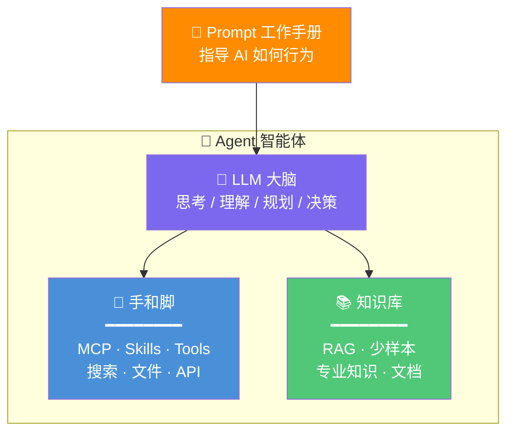

**通俗理解：**

| 组件 | 类比 | 作用 |
|------|------|------|
| LLM（大模型） | 大脑 | 理解、推理、决策 |
| MCP / Tools | 手和脚 | 操作外部工具（搜索、文件、API） |
| Skills | 技能包，说明书 | 专门训练的特定能力 |
| RAG / 知识库 | 参考书 | 提供专业知识，弥补模型不足 |
| Prompt | 工作手册，指导手册 | 指导 AI 如何行为 |

**今天的 Prompt Agent 就是最简单的 Agent 形态：**

```
Prompt（工作手册）→ LLM（大脑）→ 输出
```

> **Day 2 和 Day 3，我们将逐步加上"手和脚"和"知识库"，让 Agent 越来越强大。**

---

## 模块八：Day 1 总结（17:00 - 17:30）

### 今日要点回顾

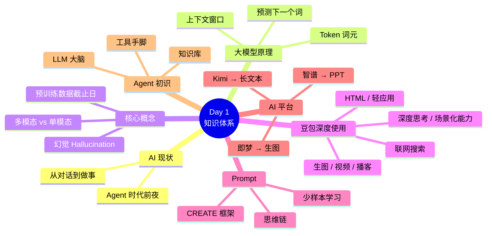

```
Day 1 你学到了：

1. AI 现状 ─── 我们正处在 Agent 时代的前夜
   │
2. 大模型原理 ─── "预测下一个词"的超级程序
   │
3. Token ─── AI 处理文字的基本单位
   │
4. 上下文 ─── 对话的所有历史，决定了 AI 的理解范围
   │
5. 幻觉 ─── AI 会"一本正经地胡说"，需要交叉验证
   │
6. 豆包 ─── 不只是聊天，还有生图、视频、播客、音乐、HTML、轻应用
   │
7. 深度模式 ─── 让 AI 先想再做，类比人类思考
   │
8. Prompt ─── 和 AI 沟通的艺术，日常直接说，复杂任务要结构化
   │
9. 智谱/Kimi/即梦 ─── 各有专长的 AI 工具
   │
10. Agent 初识 ─── LLM 大脑 + 工具手脚 + 知识库
```

### 课后练习（可选）

1. **日常任务 AI 化**：选择你工作中的一件日常任务，尝试用豆包/智谱完成。记录使用感受。
2. **Prompt 优化**：找到你之前问 AI 的问题，用今天学的 CREATE 框架重新组织，对比效果。
3. **AI 生图**：用即梦为自己的社交媒体账号生成一张配图。
4. **SVG 实验**：让豆包生成一个 SVG 图形，导入 PPT 中编辑。

### Day 2 预告

> 明天我们进入 **AI IDE 编程赋能**，开始让 AI 替你写代码。
>
> 你将学会使用 Trae（字节跳动的 AI IDE），搭建自己的 Agent，理解 MCP 和 Skills 的原理。
>

---

> **"AI 不会取代人类。但会用 AI 的人，会取代不会用 AI 的人。"**
>
> **今天，你已经迈出了第一步。**
